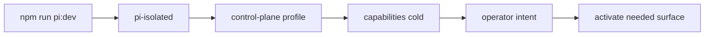
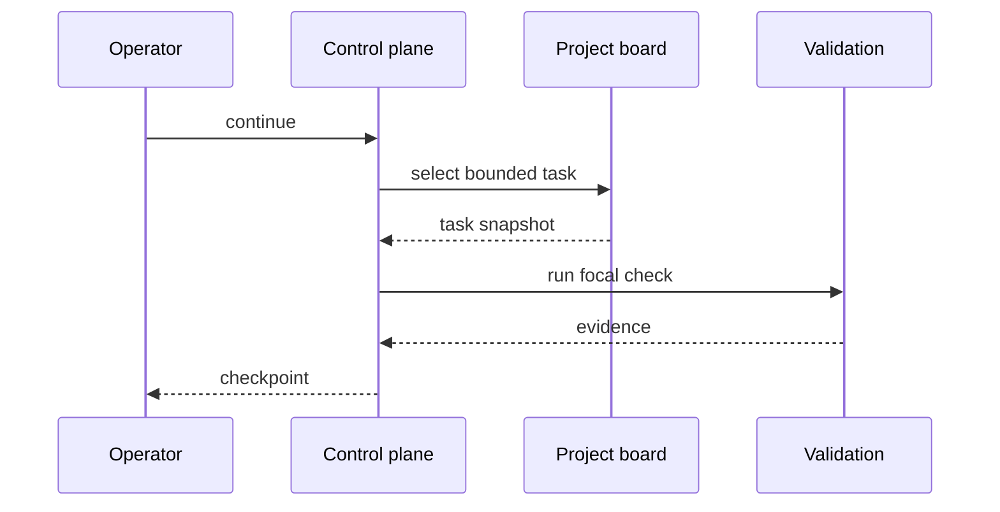

# Control Plane Runtime Map

Status: draft.

These diagrams are intentionally split by concern. They are reading aids, not a second source of truth; contracts still live in code, tests and guides.

## Startup Profile

## Local-safe Slice Loop

## Diagram Policy

For this repository, architecture diagrams should stay small enough to review in a pull request. Use `pnpm run mermaid:check:lab` for the local editorial policy. The distributed `mermaid-authoring` skill and `pnpm run mermaid:check` remain syntax-oriented and do not impose size.
