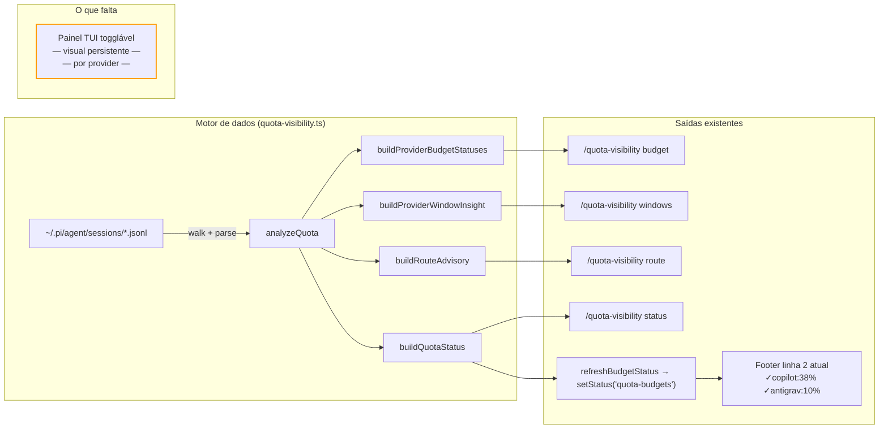
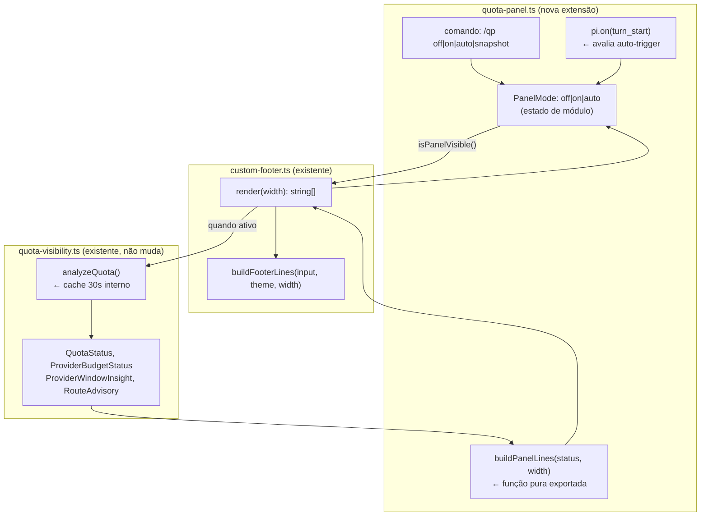
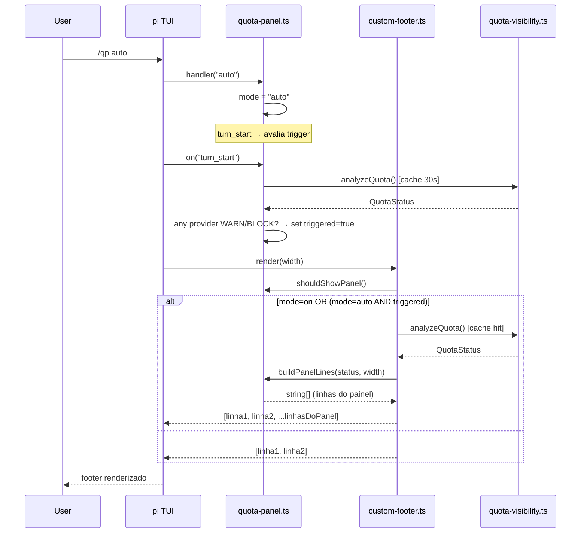

# Provider Usage TUI — Design de Visibilidade de Janelas

> Status: **rascunho de brainstorming** — aguardando clarificações antes de codificar.
> Data: 2026-04-16

---

## Por que isso importa

O projeto tem uma visão maior do que parece: abrir uma empresa e usar LLMs de forma profissional requer **prestação de contas real** — não só pagar a conta, mas saber exatamente quem usou o quê, quando, quanto custou, e se o valor foi gerado.

O painel de visibilidade de providers é o **primeiro passo operacional** dessa visão:

- Multiple contas do mesmo provider não podem ser um problema (REQ-BUD-014)
- Custos precisam ser auditáveis por sessão/modelo/conta (REQ-BUD-023)
- Roteamento de recursos precisa ser observável em tempo real (REQ-BUD-020)
- Overage nunca acontece silenciosamente — requer consentimento explícito (REQ-BUD-021)

Quando o roteador perfeito existir, essa tela de usage é a **única superfície necessária** para acompanhar o estado do sistema.

---

## O que já existe hoje

O motor de dados está completo. O que falta é a **superfície visual**.



O footer atual (2 linhas) já mostra o resumo compacto. O problema é que ele **não tem profundidade** — não é possível entender o estado de uma janela de 5h, projeções, horários de pico, ou estado por conta sem rodar um comando manual.

---

## Anatomia das camadas da TUI pi

Antes de desenhar o painel, é preciso entender o que é e o que não é controlável:

```
┌─────────────────────────────────────────────────────────────────┐
│  INPUT BOX                                                       │
│  > █                                                            │
├─────────────────────────────────────────────────────────────────┤
│  BUILT-IN STATUS BAR (pi controla, não substituível)            │
│  ◆ openai-codex/gpt-5.3-codex-spark | 0/0 $0.00 0% | ⏱44s    │
├─────────────────────────────────────────────────────────────────┤
│  CUSTOM FOOTER — setFooter() (nosso controle total)             │
│  LINE 1: ◆ provider/model | tokens $cost ctx% | ⏱elapsed       │
│  LINE 2: ⌂ cwd | ⎇ branch | ✓copilot:38% ✓antigrav:10%        │
│  [LINE 3+: PAINEL TOGGLÁVEL — a proposta]                       │
└─────────────────────────────────────────────────────────────────┘
```

| Camada | API pi | Nosso controle |
|--------|--------|----------------|
| Área de mensagens (histórico) | nenhuma | ✗ não temos |
| Status bar compacta superior | `setStatus(key, value)` | apenas o valor, não o layout |
| Footer customizado | `setFooter(factory)` | **total** — array de strings |
| Notificações efêmeras | `ctx.ui.notify(text, type)` | só texto, desaparece |
| Keybindings | desconhecido se existe | a verificar |

**Conclusão:** o único canvas persistente que controlamos totalmente é o `setFooter`. Cada string no array retornado vira uma linha extra no rodapé.

---

## Três abordagens para o painel togglável

### A) Expansão do footer (linhas extras condicionais) ← recomendada

O `setFooter` já retorna `string[]`. Quando o painel está ativo, retornamos mais linhas. Quando desligado, voltamos às 2 linhas atuais.

**Modos de exibição** (`/qp off|on|auto`):

| Modo | Comportamento | Default |
|------|---------------|---------|
| `off` | sempre oculto | ✓ sim |
| `on`  | sempre visível | — |
| `auto` | abre quando qualquer provider atinge WARN/BLOCK, fecha quando todos voltam a OK | — |

O modo `auto` é o primeiro passo de "políticas de perfil" (REQ-BUD-022) — mostra informação contextual no momento em que o usuário precisa tomar uma decisão (adicionar fundos, trocar provider, comprar créditos). Políticas mais sofisticadas (`conservative`, `throughput`) podem herdar e sobrescrever esse comportamento depois.

```
MODO off (padrão — 2 linhas):
◆ openai-codex/gpt-5.3-codex-spark | 23k/8k $0.04 2% | ⏱12m
⌂ agents-lab | ⎇ main | ✓copilot:38% ✓antigrav:10% ✓gemini:2% !codex:46%

MODO on ou auto-triggered (footer expandido):
◆ openai-codex/gpt-5.3-codex-spark | 23k/8k $0.04 2% | ⏱12m
⌂ agents-lab | ⎇ main | ✓copilot:38% ✓antigrav:10% ✓gemini:2% !codex:46%
────── Provider Usage Panel ──────────────────────────────
  copilot   MONTHLY  requests  38%  ████░░░░░░  380/1000req  $0.00
  antigrav  MONTHLY  cost      10%  █░░░░░░░░░  $6.04/$60    243Mtok
  gemini    MONTHLY  cost       2%  ░░░░░░░░░░  $1.20/$60    97Mtok
  codex     MONTHLY  cost      46%  ████▌░░░░░  $82.8/$180   318Mtok  ⚠
────── Rolling Windows (5h) ───────────────────────────────
  codex  recent=45k tok  max=182k tok  peak: 14h 15h 16h → iniciar: 09h
────── Route Advisory ─────────────────────────────────────
  balanced → antigrav (10% pressure) — codex ⚠46% copilot 38%
```

**Prós:** usa só API confirmada, sem risco de quebrar. Render síncrono no mesmo ciclo do footer.
**Contras:** ocupa espaço em terminais menores — mitigável porque `off` é o default.

---

### B) Sob demanda via notify (snapshot efêmero)

Um comando `/qp snapshot` que chama `ctx.ui.notify()` com o painel formatado. Aparece uma vez e desaparece — útil como complemento à abordagem A para "quero ver agora sem deixar aberto".

**Prós:** zero impacto no layout permanente. Sempre disponível mesmo com modo `off`.
**Contras:** não é monitoramento contínuo.

---

### C) Refresh periódico automático

O painel expande (igual A) mas reatualiza os dados a cada turn via `pi.on("turn_start")`. Útil durante swarms longos.

**Recomendação:** implementar como variante futura do modo `auto` — quando detectar swarm ativo, fazer refresh mais frequente. **Não para o v1.**

---

## Design final: extensão separada com 3 modos

**Decisões fechadas:**

| Decisão | Escolha | Razão |
|---------|---------|-------|
| Localização | `quota-panel.ts` — extensão separada | Primitiva reutilizável (TUI + web futura) |
| Modos | `off` / `on` / `auto` | Filosofia pi: usuário decide, defaults não intrusivos |
| Default | `off` | Não ocupa espaço sem intenção explícita |
| Snapshot | `/qp snapshot` — sempre disponível | Independe do modo atual |
| Refresh | On-turn (não periódico) | v1 simples; refresh ativo fica para modo `auto` + swarm v2 |
| Multi-conta | Fora do escopo v1 | Requer mudança no modelo de dados (`QuotaUsageEvent`) |
| Billing externo | Reserva de coluna, sem dados ainda | Coluna `BILLED` aparece como `n/a` até adapter existir |

### Arquitetura de módulos



### Separação de responsabilidades

| Arquivo | Responsabilidade |
|---------|-----------------|
| `quota-visibility.ts` | Motor de dados — não muda |
| `quota-panel.ts` | Estado do painel + render puro + comando `/qp` + auto-trigger |
| `custom-footer.ts` | Orquestra as 2 linhas base + injeta linhas do painel quando ativo |
| `quota-panel-state.ts` | *(opcional)* Objeto singleton de estado se acoplamento circular surgir |

### Por que `buildPanelLines` pode ir para a web

A função `buildPanelLines(status: QuotaStatus, width: number): string[]` recebe tipos puros do domínio e retorna strings. Para a web, basta uma camada de adaptação que converte as strings em componentes React — ou melhor ainda, exportar os dados estruturados via `buildPanelData(status)` e deixar a UI web renderizar do jeito dela. **O núcleo de negócio não muda.**

---

## Fluxo de dados do painel



---

## Estrutura do painel (mockup detalhado)

```
──── Provider Usage Panel [2026-04-16 14:32] ─────────────────────
  PROVIDER   PERIOD   UNIT      USED   BAR          OBSERVED    CAP
  copilot    monthly  requests   38%   ████░░░░░░   380 req     1000 req
  antigrav   monthly  cost       10%   █░░░░░░░░░   $6.04       $60.00
  gemini     monthly  cost        2%   ░░░░░░░░░░   $1.20       $60.00
  codex      monthly  cost       46%   ████▌░░░░░   $82.80      $180.00  ⚠

──── Rolling Windows (5h) ────────────────────────────────────────
  codex    recent: 45k tok   max (30d): 182k tok
           peak: 14h 15h 16h  →  iniciar antes: 09h 10h 11h
  copilot  recent:  0 req    sem histórico de janela

──── Route Advisory ──────────────────────────────────────────────
  balanced  →  antigrav  (10% pressure)  OK
             ✗ codex WARN 46%   ✗ gemini 2%   ✓ copilot 38%
```

### Barra de progresso adaptativa

A barra usa `█` e `░` com largura proporcional ao terminal. Exemplo para largura 10:

| % usado | Barra         |
|---------|---------------|
| 0%      | `░░░░░░░░░░`  |
| 10%     | `█░░░░░░░░░`  |
| 46%     | `████▌░░░░░`  |
| 75%     | `███████▌░░`  |
| 100%    | `██████████`  |

### Código de estado

| Ícone | Estado    | Threshold |
|-------|-----------|-----------|
| (nada) | OK       | < warnPct |
| `⚠`   | WARN      | >= warnPct |
| `✗`   | BLOCKED   | >= hardPct |

---

## Decisões ainda abertas (baixo impacto no v1)

Estas não bloqueiam implementação — podem ser resolvidas durante ou depois:

1. **Granularidade de seções:** o painel sempre mostra budgets + windows + route. Seções selecionáveis (`/qp budgets`, `/qp windows`) ficam para v2 se a tela ficar longa demais.

2. **`quota-panel-state.ts` separado:** só criar se surgir acoplamento circular entre `quota-panel.ts` e `custom-footer.ts` durante implementação.

---

## Escopo deste spec

Este design cobre **apenas a superfície TUI do painel** — a camada de renderização. Não cobre:

- Multi-conta (REQ-BUD-014) — mudança no modelo de dados de `QuotaUsageEvent`
- Billing externo (REQ-BUD-023) — adapter de ingestão separado
- Web replica (mencionada pelo usuário) — será derivada desta TUI, não o contrário
- Roteador automático — o painel é observabilidade, não execução

A sequência natural é: **TUI consolidada → multi-conta → billing externo → web**.

---

## Sequência de implementação

1. `quota-panel.ts` — extensão separada com `buildPanelLines`, estado do modo, comando `/qp`, `on("turn_start")` para auto-trigger
2. `custom-footer.ts` — adicionar chamada a `shouldShowPanel()` e injetar linhas extras quando ativo
3. `package.json` (`pi.extensions`) — adicionar `quota-panel.ts` **antes** de `custom-footer.ts` (ordem importa: panel registra antes, footer lê estado)
4. Testes — `buildPanelLines` pure function, estado do modo, auto-trigger lógica
5. `docs/guides/quota-visibility.md` — documentar `/qp off|on|auto|snapshot`
