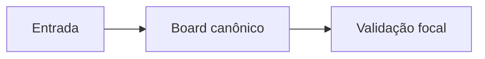
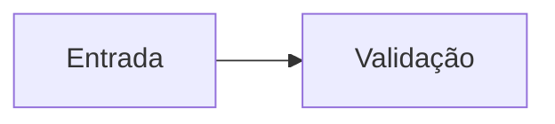

# Mermaid Authoring

Use Mermaid when a relationship is easier to inspect as a diagram than as prose. Keep the source text readable in Markdown because some renderers show the code block before rendering.

## Portable Syntax

- Use ASCII node/state ids and put Portuguese or domain text in labels.
- Quote labels that contain `/`, emoji, punctuation-heavy text or long prose.
- Avoid `[[wikilinks]]` in edge labels; use plain labels and link in surrounding Markdown.
- Prefer one diagram type per idea. Split only when the audience would need to zoom or scroll to understand it.

Good:



Risky:



`Entrada` and `Validação` are interpreted as ids. Some Mermaid renderers reject non-ASCII ids even when the label looks fine.

## Where To Put Diagrams

- Inline fenced blocks are best for GitHub, Jekyll, Astro and Obsidian-style notes.
- `.mermaid` source files are best when the project also commits generated SVGs.
- Generated SVGs require a renderer such as `mmdc` and usually Chromium/Puppeteer. Keep that as a project policy, not a generic requirement.
- Site generators can wrap code blocks. If a project renders Mermaid client-side, smoke-test the generated HTML to ensure the source can still be reconstructed.
- Template engines such as Liquid may interpret double-curly template delimiters. Escape those snippets with the project-supported raw block before publishing.

## Validation

In agents-lab:

```bash
pnpm run mermaid:check
pnpm run docs:site:build:smoke
```

The Mermaid check validates portable syntax in Markdown fences and `.mermaid` files. It does not enforce a diagram size policy. A site smoke validates the generated artifact when diagrams are published through a static site.
