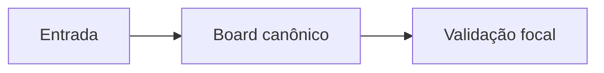
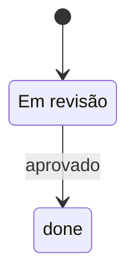

# Mermaid Authoring

Use this skill when creating or reviewing Mermaid diagrams.

## Goal

Produce Mermaid that renders across common Markdown and docs surfaces without assuming a specific site generator.

## Rules

- Use ASCII ids for nodes/states.
- Put Portuguese, accents and domain language in quoted labels.
- Do not use `[[wikilinks]]` inside Mermaid edge labels.
- Quote labels containing `/`, emoji or punctuation-heavy text.
- Keep renderer-specific choices out of the diagram unless the project documents them.
- If the output is a generated site, validate the generated artifact, not only the Markdown source.
- Escape template-engine delimiters such as double-curly placeholders when publishing through Jekyll/Liquid or similar engines.

## Patterns

Flowchart:



State diagram:



## Validation

If the repo provides a Mermaid check, run it. In agents-lab:

```bash
pnpm run mermaid:check
pnpm run docs:site:build:smoke
```

If the project commits generated SVGs, also run the project-specific generation/sync command. If the project renders diagrams client-side, run its site smoke to confirm the built HTML still contains reconstructable Mermaid source.
